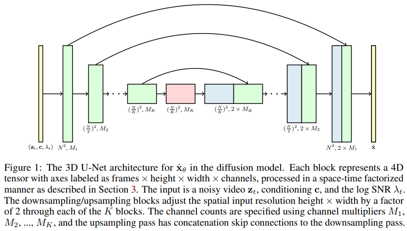
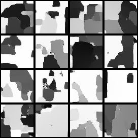

*these fireworks do not exist*

## Video Diffusion - Pytorch (wip)

Text to video, it is happening! <a href="https://video-diffusion.github.io/">Official Project Page</a>

Implementation of <a href="https://arxiv.org/abs/2204.03458">Video Diffusion Models</a>, <a href="http://www.jonathanho.me/">Jonathan Ho</a>'s new paper extending DDPMs to Video Generation - in Pytorch. It uses a special space-time factored U-net, extending generation from 2d images to 3d videos

</img>

## Status

14k for difficult moving mnist (converging much faster and better than <a href="https://wandb.ai/lucidrains/nuwa-moving-mnist/reports/moving-mnist-nuwa--VmlldzoxNjk3MjI3?accessToken=cx03lswmr4bxj9dhrzzm5c3xebdmfq28a4dqzsoq9n89by6ppofukq7bxp19078j">NUWA</a>) - wip



## Install

```bash
$ pip install video-diffusion-pytorch
```

## Usage

```python
import torch
from video_diffusion_pytorch import Unet3D, GaussianDiffusion

model = Unet3D(
    dim = 64,
    dim_mults = (1, 2, 4, 8)
)

diffusion = GaussianDiffusion(
    model,
    image_size = 32,
    num_frames = 5,
    timesteps = 1000,   # number of steps
    loss_type = 'l1'    # L1 or L2
)

videos = torch.randn(1, 3, 5, 32, 32) # video (batch, channels, frames, height, width) - normalized from -1 to +1
loss = diffusion(videos)
loss.backward()
# after a lot of training

sampled_videos = diffusion.sample(batch_size = 4)
sampled_videos.shape # (4, 3, 5, 32, 32)
```

For conditioning on text, they derived text embeddings by first passing the tokenized text through BERT-large. Then you just have to train it like so

```python
import torch
from video_diffusion_pytorch import Unet3D, GaussianDiffusion

model = Unet3D(
    dim = 64,
    cond_dim = 64,
    dim_mults = (1, 2, 4, 8)
)

diffusion = GaussianDiffusion(
    model,
    image_size = 32,
    num_frames = 5,
    timesteps = 1000,   # number of steps
    loss_type = 'l1'    # L1 or L2
)

videos = torch.randn(2, 3, 5, 32, 32) # video (batch, channels, frames, height, width)
text = torch.randn(2, 64)             # assume output of BERT-large has dimension of 64

loss = diffusion(videos, cond = text)
loss.backward()
# after a lot of training

sampled_videos = diffusion.sample(cond = text)
sampled_videos.shape # (2, 3, 5, 32, 32)
```

You can also directly pass in the descriptions of the video as strings, if you plan on using BERT-base for text conditioning

```python
import torch
from video_diffusion_pytorch import Unet3D, GaussianDiffusion

model = Unet3D(
    dim = 64,
    use_bert_text_cond = True,  # this must be set to True to auto-use the bert model dimensions
    dim_mults = (1, 2, 4, 8),
)

diffusion = GaussianDiffusion(
    model,
    image_size = 32,    # height and width of frames
    num_frames = 5,     # number of video frames
    timesteps = 1000,   # number of steps
    loss_type = 'l1'    # L1 or L2
)

videos = torch.randn(3, 3, 5, 32, 32) # video (batch, channels, frames, height, width)

text = [
    'a whale breaching from afar',
    'young girl blowing out candles on her birthday cake',
    'fireworks with blue and green sparkles'
]

loss = diffusion(videos, cond = text)
loss.backward()
# after a lot of training

sampled_videos = diffusion.sample(cond = text, cond_scale = 2)
sampled_videos.shape # (3, 3, 5, 32, 32)
```

## Training

This repository also contains a handy `Trainer` class for training on a folder of `gifs`. Each `gif` must be of the correct dimensions `image_size` and `num_frames`.

```python
import torch
from video_diffusion_pytorch import Unet3D, GaussianDiffusion, Trainer

model = Unet3D(
    dim = 64,
    dim_mults = (1, 2, 4, 8),
)

diffusion = GaussianDiffusion(
    model,
    image_size = 64,
    num_frames = 10,
    timesteps = 1000,   # number of steps
    loss_type = 'l1'    # L1 or L2
).cuda()

trainer = Trainer(
    diffusion,
    './data',                         # this folder path needs to contain all your training data, as .gif files, of correct image size and number of frames
    train_batch_size = 32,
    train_lr = 1e-4,
    save_and_sample_every = 1000,
    train_num_steps = 700000,         # total training steps
    gradient_accumulate_every = 2,    # gradient accumulation steps
    ema_decay = 0.995,                # exponential moving average decay
    amp = True                        # turn on mixed precision
)

trainer.train()
```

Sample videos (as `gif` files) will be saved to `./results` periodically, as are the diffusion model parameters.

## Co-training Images and Video

One of the claims in the paper is that by doing factored space-time attention, one can force the network to attend on the present for training images and video in conjunction, leading to better results.

It was not clear how they achieved this, but I furthered a guess.

To arrest attention to the present moment for a certain percentage of batch videos samples, simply pass `prob_focus_present = <prob>` on the diffusion forward method

```python
loss = diffusion(videos, cond = text, prob_focus_present = 0.5) # for 50% of videos, focus on the present during training
loss.backward()
```

If you have a better idea how this is done, just open a github issue.

## Todo

- [x] wire up text conditioning, use classifier free guidance
- [x] relative positional encodings in attention (space and time) - use T5 relative positional bias instead of what they used
- [x] add a forward keyword argument that arrests attention across time (as reported / claimed in the paper, this type of image + video simultaneous training improves results)
- [x] consider doing a 3d version of CLIP, so one can eventually apply the lessons of DALL-E2 to video https://github.com/lucidrains/dalle2-video
- [x] offer way for Trainer to curtail or pad frames, if gif is too long
- [ ] find a good torchvideo-like library (torchvideo seems immature) for training on fireworks
- [ ] project text into 4-8 tokens, and use them as memory key / values to condition both time and space in attention blocks
- [ ] prepare a jax version for large scale TPU training
- [ ] have Trainer take care of conditional video synthesis, with text offered as corresponding {video_filename}.txt within the same folder
- [ ] see if ffcv or squirrel-core is a good fit
- [ ] bring in token shifts, along time and space

## Citations

```bibtex
@misc{ho2022video,
  title   = {Video Diffusion Models}, 
  author  = {Jonathan Ho and Tim Salimans and Alexey Gritsenko and William Chan and Mohammad Norouzi and David J. Fleet},
  year    = {2022},
  eprint  = {2204.03458},
  archivePrefix = {arXiv},
  primaryClass = {cs.CV}
}
```

```bibtex
@misc{Saharia2022,
    title   = {Imagen: unprecedented photorealism × deep level of language understanding},
    author  = {Chitwan Saharia*, William Chan*, Saurabh Saxena†, Lala Li†, Jay Whang†, Emily Denton, Seyed Kamyar Seyed Ghasemipour, Burcu Karagol Ayan, S. Sara Mahdavi, Rapha Gontijo Lopes, Tim Salimans, Jonathan Ho†, David Fleet†, Mohammad Norouzi*},
    year    = {2022}
}
```
